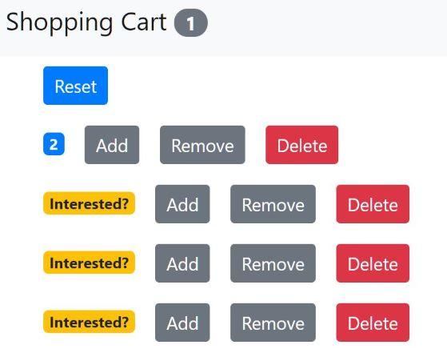

# React - Shopping Cart

- A simple React app that allows you to add, remove, delete and reset items from your shopping cart.



---

#### Tutorial I followed:

- [React Tutorial - Learn React - React Crash Course [2019] by Programming with Mosh](https://www.youtube.com/watch?v=Ke90Tje7VS0&t=62s)

#### Dependencies:

- Bootstrap (@4.1.1)

---

**1. Install Bootstrap**

```
npm i bootstrap@4.1.1
```

src\index.js

```javascript
import "bootstrap/dist/css/bootstrap.css";
```

- After that, if you go to the browser, you'll see the font changed.

**2. Counter.jsx**

src\components\counter.jsx

**3. Counters.jsx**

src\components\counters.jsx

**4. navbar.jsx**
**5. index.js**
**6. app.js**
