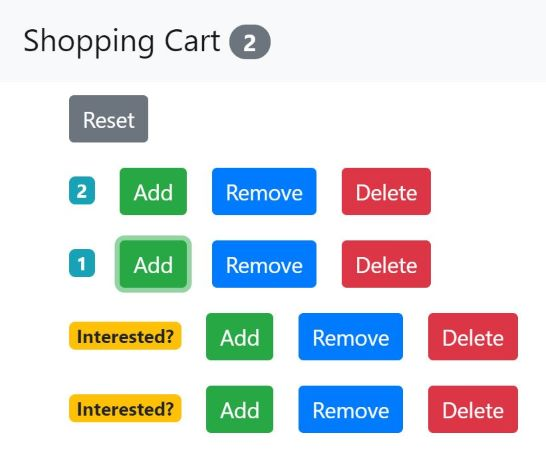

# React - Shopping Cart

- A simple React app that allows you to add, remove, delete and reset items in your shopping cart.



---

#### Tutorial I followed:

[React Tutorial - Learn React - React Crash Course [2019] by Programming with Mosh](https://www.youtube.com/watch?v=Ke90Tje7VS0&t=62s)

    26:15 Your First React Component
    31:38 Specifying Children
    35:56 Embedding Expressions
    40:49 Setting Attributes
    46:36 Rendering Classes Dynamically
    50:57 Rendering Lists
    54:58 Conditional Rendering
    1:01:04 Handling Events
    1:03:56 Binding Event Handlers
    1:08:34 Updating the State
    1:10:51 What Happens When State Changes
    1:12:58 Passing Event Arguments
    1:17:31 Composing Components
    1:21:18 Passing Data to Components
    1:24:31 Passing Children
    1:27:44 Debugging React Apps
    1:31:55 Props vs State
    1:34:22 Raising and Handling Events
    1:39:16 Updating the State
    1:43:57 Single Source of Truth
    1:47:55 Removing the Local State
    1:54:44 Multiple Components in Sync
    2:00:39 Lifting the State Up
    2:06:18 Stateless Functional Components
    2:08:49 Destructuring Arguments
    2:10:52 Lifecycle Hooks
    2:12:32 Mounting Phase
    2:18:09 Updating Phase
    2:22:31 Unmounting Phase

---

### Dependencies:

- Bootstrap (@4.1.1)

### Steps:

**1. Install Bootstrap**

```
npm i bootstrap@4.1.1
```

src\index.js

```javascript
import "bootstrap/dist/css/bootstrap.css";
```

- After that, if you go to the browser, you'll see the font changed.

**2. Counter.jsx**

src\components\counter.jsx

**3. Counters.jsx**

src\components\counters.jsx

**4. navbar.jsx**

src\components\navbar.jsx

**5. App.js**

src\App.js
